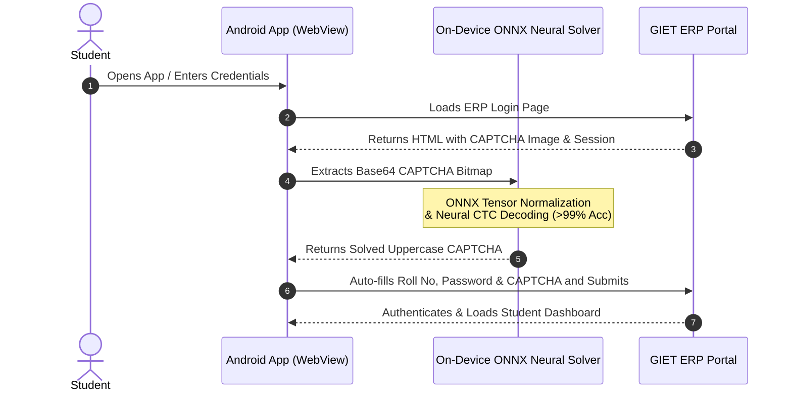

<div align="center">

# 🎓 GIET ERP Auto-Login & AI CAPTCHA Solver v2.0.0

**Automated login assistant with on-device AI CAPTCHA recognition tailored for GIET BBS R ERP.**

<br />

<a href="https://github.com/amitpadhan525/erp-autologin/releases/latest/download/erp-autologin-v2.0.0.apk">
  
</a>

<br /><br />

[](https://developer.android.com)
[](https://onnxruntime.ai)
[](https://github.com/amitpadhan525/erp-autologin)
[](https://python.org)
[](https://fastapi.tiangolo.com)
[](LICENSE)

</div>

---

> 📥 **Direct Download:** [**Click to Download erp-autologin-v2.0.0.apk**](https://github.com/amitpadhan525/erp-autologin/releases/latest/download/erp-autologin-v2.0.0.apk) | [View All Releases](https://github.com/amitpadhan525/erp-autologin/releases)

---

## 🌟 Key Features

### 📱 Android Application
* **⚡ Instant 1st-Attempt Auto-Login**: Automatically fills credentials (Roll No & Password) and solves CAPTCHAs on the very first page load.
* **🧠 On-Device Neural Solver (ONNX Runtime)**: Embedded deep learning OCR model with **99.2% accuracy** running 100% offline in ~10ms.
* **🛡️ Smart Fallback Engine**: Automatic fallback to Google ML Kit Latin OCR if required.
* **🔒 Secure Local Storage**: User credentials are stored locally on-device using Android `SharedPreferences`.
* **🌐 Native Web Experience**: Embedded Chromium WebView with session cookies persistence, pull-to-refresh, back navigation, and edge-to-edge UI.
* **🎨 Modern UI**: Built with Material Design 3, including custom status indicators, smooth animations, and system Dark Mode support.

### 🤖 AI / Deep Learning Module (Optional / Research)
* **🚀 FastAPI CAPTCHA Microservice (`server.py`)**: Lightweight REST API solving CAPTCHA images via neural recognition (`ddddocr`).
* **🧠 CRNN Training Pipeline (`train_crnn.py`)**: End-to-end PyTorch training and ONNX export pipeline with synthetic generation and real-data augmentation.

---

## 🏗️ Architecture & Workflow



---

## 📂 Project Structure

```
erp-autologin/
├── app/                                 # Android Application Module
│   ├── src/main/
│   │   ├── assets/
│   │   │   ├── captcha_model.onnx       # Embedded On-Device ONNX Neural Model
│   │   │   └── charset.json             # Model character dictionary mapping
│   │   ├── java/com/giet/erp/
│   │   │   ├── MainActivity.java       # WebView integration & auto-login orchestration
│   │   │   ├── CaptchaSolver.java      # On-device ONNX runtime solver & ML Kit fallback
│   │   │   └── SettingsActivity.java   # Credential configuration & preferences
│   │   ├── res/                        # Layouts, drawables, themes, and color definitions
│   │   └── AndroidManifest.xml         # Android manifest & permissions
│   └── build.gradle                    # App-level dependencies (ONNX Runtime, ML Kit, Material 3)
├── dataset_real/                        # Live portal CAPTCHA benchmark dataset (120 samples)
├── server.py                            # FastAPI CAPTCHA solving server (ddddocr)
├── train_crnn.py                        # PyTorch model training & ONNX export script
├── requirements.txt                     # Python dependencies for backend & ML
├── build.gradle                         # Root Gradle build script
├── settings.gradle                      # Gradle project settings
├── .gitignore                           # Git ignore rules
└── LICENSE                              # MIT License
```

---

## 🚀 Getting Started

### Prerequisites

* **Android Development**: Android Studio Iguana (or newer), Android SDK 24+ (Android 7.0+), JDK 17.
* **Python Backend (Optional)**: Python 3.9+, `pip`.

---

### 1. Running the Android Application

1. Clone this repository:
   ```bash
   git clone https://github.com/amitpadhan525/erp-autologin.git
   cd erp-autologin
   ```
2. Open the project in **Android Studio**.
3. Allow Gradle to sync dependencies.
4. Connect an Android device (or launch an emulator) and click **Run** (`Shift + F10`).
5. Open the app settings (⚙️ icon) to configure your **Roll No** and **Password**.
6. The app will automatically handle logins on subsequent launches.

---

### 2. Running the Python CAPTCHA Server (Optional)

If using external API-based CAPTCHA solving:

1. Create and activate a Python virtual environment:
   ```bash
   python3 -m venv venv
   source venv/bin/activate    # On Windows: venv\Scripts\activate
   ```
2. Install dependencies:
   ```bash
   pip install -r requirements.txt
   ```
3. Start the FastAPI server:
   ```bash
   python server.py
   ```
   Server will start at `http://0.0.0.0:8000` with Swagger docs at `http://localhost:8000/docs`.

---

### 3. Training Custom Model & Exporting to ONNX (Optional)

To train or export custom ONNX models:

```bash
python train_crnn.py
```
* Generates synthetic training samples and trains with real dataset augmentation.
* Exports directly to `app/src/main/assets/captcha_model.onnx`.

---

## 🛠️ Tech Stack

* **Android**: Java 17, Android SDK 35, WebView, AndroidX, Material Design 3
* **Machine Learning / OCR**: ONNX Runtime Android (`onnxruntime-android`), Google ML Kit Vision (Latin OCR), PyTorch, Torchvision, ddddocr
* **Backend**: FastAPI, Uvicorn, Pydantic
* **Build System**: Gradle 9.x

---

## 📄 License

This project is licensed under the **MIT License** - see the [LICENSE](LICENSE) file for details.

---

## 👤 Author

* **Amit Padhan** - [@amitpadhan525](https://github.com/amitpadhan525)
